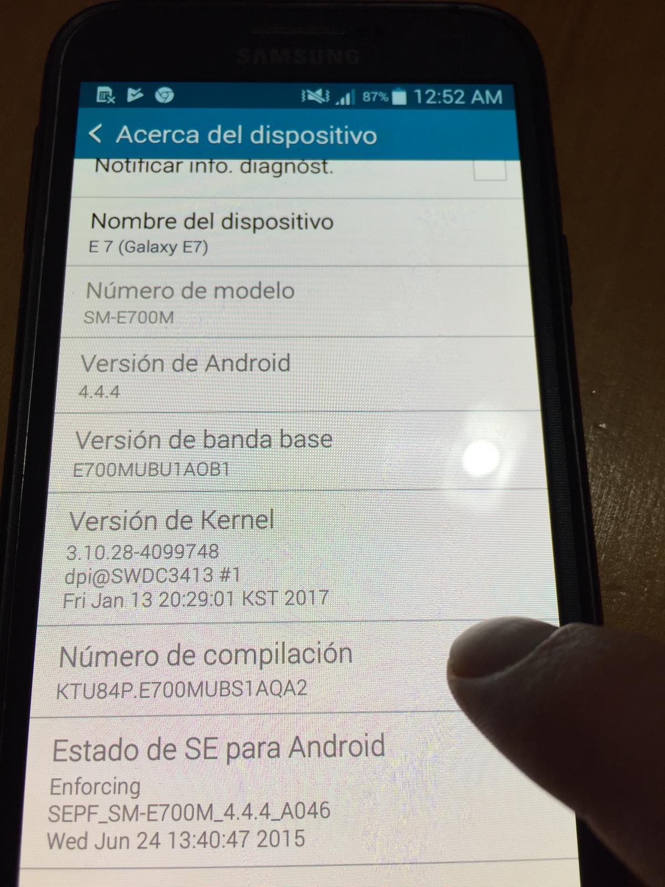
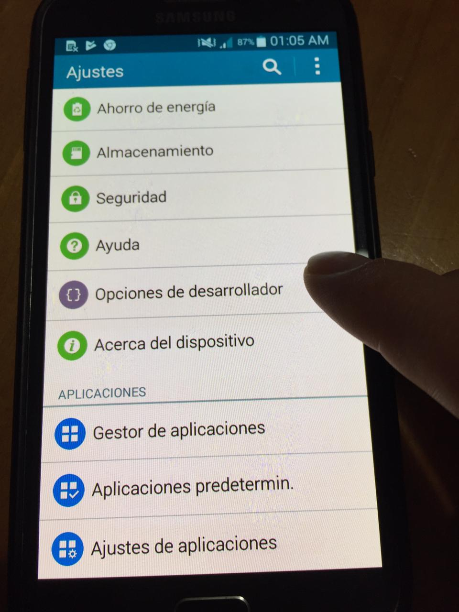

# APR_BD_Externa

APR_BD_EXTERNA
=============

SUBIR DATOS A UNA BD EXTERNA
---------------------------- 
Descripción:
Este prototipo se creó para lograr que una Aplicación móvil
nos permita ingresar datos en dicha aplicación y que los almacene en
una Base de Datos externa SQL.

SOFTWARE UTILIZADO
==================
Para MacBook Pro (Retina, 13-inch, Late 2013)
-------------
- Android Studio   Versión 3.2.1  
- El paquete de Software (XAMPP-OSX-7.2.12)

LINK DE DESCARGA
===================
- Android Studio [developer.android.com](https://developer.android.com/studio/?hl=es-419)

- [XAMPP] (https://www.apachefriends.org/es/index.html)

PARA HABILITAR OPCIONES DE DESARROLLADOR DEL DISPOSITIVO MÓVIL
=====================================
Pasos a seguir:

- Ir a Ajustes
- Acerca del (dispositivo o teléfono).
- Número de compilación.
  .
- Verá un mensaje a medida que se aproxime a los 7 toques.
- Toque la flecha hacia atrás una vez haya terminado y aparecerá
  Opciones del desarrollador en Ajustes.
  
- Presione donde dice Opciones de desarrollador y hablitela, se pondrá verde
- Aceptas el mesaje de Usar ajustes de desarrolador
- Habilite la Opción de Depuración de USB
- Con esto tendra su dispositivo listo para utilizar en modo programdor.
   

